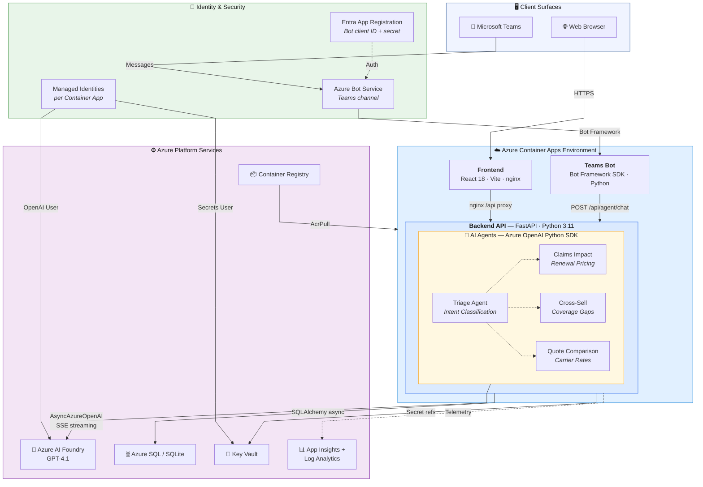
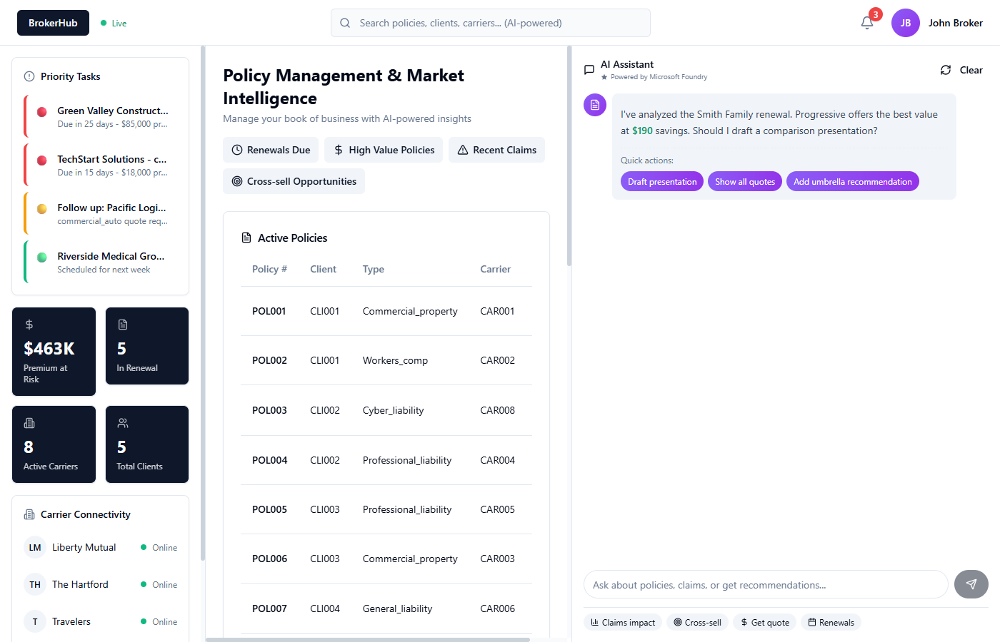
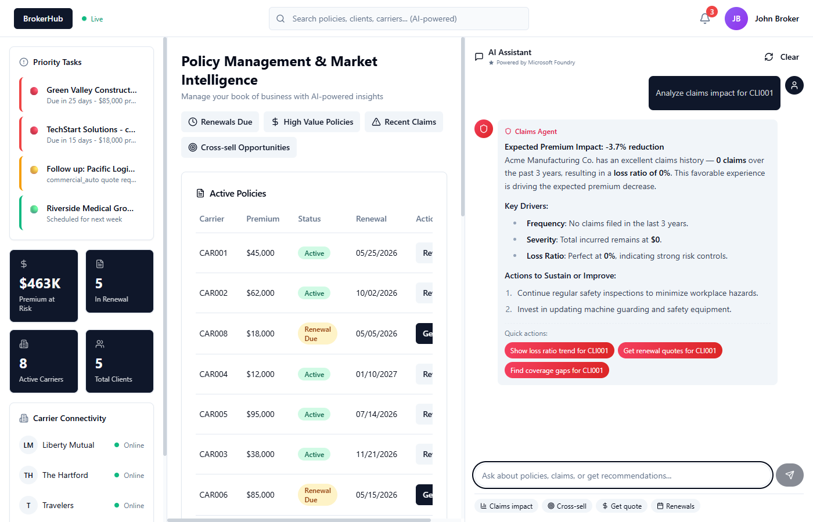

# 🏢 BrokerWorkbench

An AI-powered insurance broker workbench that surfaces the same intelligent agents across a web hub and Microsoft Teams. Brokers can manage policies, track renewals, and get AI-powered insights — whether they're in the web dashboard or flipping to a Teams conversation. Built on Azure Container Apps, Azure AI Foundry, and Bot Framework.

## 🏗️ Architecture



## 🎯 Key Demo Story

**One brain, two surfaces.** The same AI agents (Claims, Cross-Sell, Quote) power both the web workbench and Microsoft Teams — no duplication, no separate backends.

| Surface | Experience |
|---------|-----------|
| **Web Hub** | Full dashboard with policy tables, renewal tracking, interactive charts, and a resizable AI chat panel with SSE token streaming |
| **Microsoft Teams** | Same agents, same intelligence — delivered as polished Adaptive Cards with tables, urgency badges, and clickable follow-up suggestions |

A broker opens the web workbench to review their book of business, then flips to Teams and asks the same agent about a client's claims history — and gets the same quality answer.

## 📸 Screenshots

### Web Dashboard
The full workbench with priority tasks, $463K premium at risk, policy table, and carrier connectivity status.



### AI Chat — Claims Agent
The Claims Impact Agent analyzes a client's loss history, shows expected premium impact, and suggests follow-up actions — all streamed token-by-token in real time.



## 🌐 Live Demo

| Surface | URL |
|---------|-----|
| Web Workbench | [ca-frontend-brokerworkbench-dev.thankfulpond-970c315d.westus2.azurecontainerapps.io](https://ca-frontend-brokerworkbench-dev.thankfulpond-970c315d.westus2.azurecontainerapps.io) |
| Backend API | [ca-backend-brokerworkbench-dev.thankfulpond-970c315d.westus2.azurecontainerapps.io](https://ca-backend-brokerworkbench-dev.thankfulpond-970c315d.westus2.azurecontainerapps.io/docs) |
| Bot Health | [ca-bot-brokerworkbench-dev.thankfulpond-970c315d.westus2.azurecontainerapps.io/health](https://ca-bot-brokerworkbench-dev.thankfulpond-970c315d.westus2.azurecontainerapps.io/health) |
| Teams Bot | Sideload `bot/BrokerWorkbench-Bot.zip` in Teams |

## 🚀 Quick Start

### Option 1: Docker Compose (Local Development)

```bash
# Authenticate with Azure (needed for AI agent calls)
az login

# Start everything
docker-compose up --build
```

| Service | URL |
|---------|-----|
| Frontend | http://localhost:8080 |
| Backend API | http://localhost:8000 |
| API Docs (Swagger) | http://localhost:8000/docs |

### Option 2: Local Development (No Docker)

**Backend:**
```bash
cd backend
python -m venv venv
source venv/bin/activate  # Linux/Mac — on Windows: venv\Scripts\activate
pip install -r requirements.txt
uvicorn main:app --reload --port 8000
```

**Frontend (React):**
```bash
cd frontend-react
npm install
npm run dev
```

### Option 3: Deploy to Azure Container Apps

Full step-by-step guide: **[infra/README.md](infra/README.md)**

```bash
# 1. Create resource group & deploy infrastructure
az group create --name rg-brokerworkbench-dev --location <REGION>
az deployment group create \
  --resource-group rg-brokerworkbench-dev \
  --template-file infra/main.bicep \
  --parameters infra/main.bicepparam

# 2. Build & push images via ACR cloud build
ACR_NAME=$(az acr list -g rg-brokerworkbench-dev --query "[0].name" -o tsv)
az acr build --registry $ACR_NAME --image broker-backend:latest  ./backend
az acr build --registry $ACR_NAME --image broker-frontend:latest ./frontend-react

# 3. Update Container Apps with real images
ACR_SERVER=$(az acr show -n $ACR_NAME --query loginServer -o tsv)
az containerapp update -g rg-brokerworkbench-dev -n ca-backend-brokerworkbench-dev \
  --image "${ACR_SERVER}/broker-backend:latest"
az containerapp update -g rg-brokerworkbench-dev -n ca-frontend-brokerworkbench-dev \
  --image "${ACR_SERVER}/broker-frontend:latest"
```

> **Re-deploy after code changes** — repeat steps 2–3 only.

A streamlined Bicep template (`infra/main-demo.bicep`) is also available for quick demos — it skips Azure SQL and VNet, using SQLite with mock data and referencing an existing AI Foundry account.

## 📁 Project Structure

```
├── backend/              # FastAPI backend (Python 3.11)
│   ├── agents/           #   AI agents — Claims, Cross-sell, Quote
│   ├── db/               #   SQLAlchemy models, connection, repository
│   ├── models/           #   Pydantic schemas
│   ├── routers/          #   API endpoints (v1 mock, v2 SQLite, agents)
│   └── services/         #   Business logic (renewal tracker)
├── bot/                  # Teams Bot adapter (Python, Bot Framework)
│   ├── bot.py            #   TeamsActivityHandler — message routing
│   ├── card_formatter.py #   Markdown → Adaptive Card converter
│   ├── main.py           #   aiohttp server (/api/messages, /health)
│   └── teams-manifest/   #   Teams app manifest for sideloading
├── frontend-react/       # React 18 + TypeScript + Vite frontend
│   └── src/components/   #   UI components (chat, dashboard, layout)
├── data/db/              # SQLite databases, setup scripts, ER diagram
├── infra/                # Azure Bicep IaC templates
│   ├── main.bicep        #   Full production template (VNet, SQL, KV, AI)
│   └── main-demo.bicep   #   Streamlined demo template (Container Apps only)
└── docker-compose.yml    # Local development orchestration
```

## ✨ Features

### 📊 Policy Management
- Full CRUD for policies, clients, and carriers
- Renewal tracking with priority scoring and urgency levels
- Dashboard views with filtering and search

### 🤖 AI Agents (Azure AI Foundry)
- **Claims Impact Agent** — Analyzes claims history and renewal pricing impact
- **Cross-Sell Agent** — Identifies coverage gaps and upsell opportunities
- **Quote Comparison Agent** — Compares rates across carriers
- **Token-by-token SSE streaming** — responses stream live via `POST /api/agent/chat/stream`; the chat panel shows tool-call status and a blinking cursor while text arrives

### 💬 Microsoft Teams Integration
- Same AI agents accessible via Teams chat (personal or team scope)
- Polished Adaptive Cards with agent avatars, colored headers, and urgency badges
- Wide tables auto-convert to vertical FactSet cards for readability
- Clickable follow-up suggestion buttons on every response
- Conversation history with `/reset` command to clear context
- Welcome card with example prompts when the bot is added

### 🖥️ Modern React Frontend
- Resizable AI chat panel with unique agent avatars and colors
- Animated transitions (Framer Motion) and interactive charts (Recharts)
- Smart suggestion pills parsed from agent responses
- Real-time API connection status indicator
- Tailwind CSS + Shadcn/ui component library

### 🗄️ Database
- **Dev:** SQLite with async support (aiosqlite)
- **Prod:** Azure SQL with private endpoint (swap via `DATABASE_URL`)
- SQLAlchemy ORM with async sessions

### 🔐 Security
- Azure Entra ID authentication only — no API keys
- User-assigned managed identities with least-privilege RBAC
- `ChainedTokenCredential` — Environment → ManagedIdentity → AzureCLI fallback
- Key Vault secret references for connection strings

## 🔌 API Endpoints

| Endpoint | Method | Description |
|----------|--------|-------------|
| `/api/v2/policies` | GET | List all policies (SQLite/SQL) |
| `/api/v2/clients` | GET | List all clients |
| `/api/v2/carriers` | GET | List all carriers |
| `/api/renewals/dashboard` | GET | Renewal tracking dashboard |
| `/api/agent/chat` | POST | Chat with AI agents (full JSON response) |
| `/api/agent/chat/stream` | POST | Chat with AI agents (SSE token stream) |
| `/api/agent/chat` | GET | Chat (query-param alias for proxy-blocked envs) |
| `/api/agent/health` | GET | AI config, credential, and deployment health check |
| `/api/messages` | POST | Bot Framework message endpoint (bot service) |
| `/health` | GET | API health check |

Interactive API docs available at `/docs` when the backend is running.

## 🛠️ Tech Stack

| Layer | Technology |
|-------|------------|
| Frontend | React 18, TypeScript, Vite, Tailwind CSS, Shadcn/ui, Framer Motion, Recharts |
| Backend | FastAPI, SQLAlchemy (async), Pydantic v2 |
| AI | Azure AI Foundry, GPT-4o, AsyncAzureOpenAI, SSE streaming |
| Database | SQLite + aiosqlite (dev), Azure SQL + aioodbc (prod) |
| Auth | Azure Entra ID, Managed Identity, ChainedTokenCredential |
| Teams Bot | Bot Framework SDK, aiohttp, Adaptive Cards, httpx |
| Bot Infra | Azure Bot Service (F0), Entra App Registration |
| Infra | Azure Container Apps, ACR, Key Vault, App Insights, Bicep IaC |
| Local Dev | Docker Compose, nginx reverse proxy |

## 🔧 Troubleshooting

### Azure Container Apps — Common Deployment Issues

| Symptom | Cause | Fix |
|---------|-------|-----|
| Placeholder "hello world" page | Container App still using the MCR placeholder image | Update with real image from ACR (see deploy step 3) |
| `MANIFEST_UNKNOWN` on image pull | Wrong image name pushed | Use exact tags: `broker-frontend` and `broker-backend` |
| Revision stuck in `ActivationFailed` | Missing `AcrPull` RBAC on ACR | Grant `AcrPull` to both managed identities on the ACR |
| Frontend `/api` returns 502 | `API_BACKEND_URL` env var not set on frontend | Set it to `https://<backend-fqdn>` |
| nginx 502 on agent chat | `Host` header forwarding wrong hostname | Set `proxy_set_header Host $proxy_host` in nginx config |
| TLS handshake fails to backend | nginx not sending SNI hostname | Add `proxy_ssl_server_name on;` to nginx proxy block |

### Local AI Agent Auth

All agent calls authenticate with **Azure Entra ID only** — no API keys.  Two paths are supported in local Docker:

### Path A — Azure CLI cache mount (recommended)

```bash
# 1. Log in on the HOST (not inside the container)
az login

# 2. Confirm the right subscription is active
az account show --query "{name:name, id:id}" -o table

# 3. Start the stack — the ~/.azure dir is bind-mounted into the container
docker-compose up --build
```

`docker-compose.yml` sets `AZURE_CONFIG_DIR=/home/appuser/.azure` so the `AzureCliCredential` inside the container finds the mounted token cache automatically. The mount must be **read-write** because the Azure CLI writes command logs to `~/.azure/commands/`.

### Path B — Service Principal

```bash
# 1. Create a service principal
az ad sp create-for-rbac --name broker-local-dev --skip-assignment

# 2. Assign the required RBAC role on your Azure OpenAI resource
az role assignment create \
  --role "Cognitive Services OpenAI User" \
  --assignee <SP_CLIENT_ID> \
  --scope /subscriptions/<SUBSCRIPTION_ID>/resourceGroups/<RG>/providers/Microsoft.CognitiveServices/accounts/<RESOURCE_NAME>

# 3. Add to .env (all three must be set together):
#    AZURE_CLIENT_ID=<appId from step 1>
#    AZURE_TENANT_ID=<tenant from step 1>
#    AZURE_CLIENT_SECRET=<password from step 1>

# 4. Restart
docker-compose up
```

### Required RBAC role

The principal used (CLI user or SP) needs **`Cognitive Services OpenAI User`** on the Azure OpenAI resource (not the resource group — scope it to the resource for least privilege).

### Diagnostic endpoint

After the stack is running, hit the health endpoint first — it shows exactly which step is failing:

```bash
curl -s http://localhost:8000/api/agent/health | python3 -m json.tool
```

Expected successful response:
```json
{
  "status": "ok",
  "config": { "AZURE_AI_FOUNDRY_ENDPOINT": "https://...", "status": "ok" },
  "credential": { "status": "ok", "token_acquired": true },
  "endpoint": { "status": "ok", "deployment": "gpt-4.1", "model": "gpt-4.1", "status_detail": "succeeded" }
}
```

### Verify agent endpoints step by step

```bash
# 1. Health (config + auth + deployment listing)
curl http://localhost:8000/api/agent/health

# 2. List available agents (no auth required, shows config)
curl http://localhost:8000/api/agent/agents

# 3. Test a full agent call
curl -s -X POST http://localhost:8000/api/agent/chat \
  -H "Content-Type: application/json" \
  -d '{"message": "What carriers offer cyber liability?", "agent": "quote"}' \
  | python3 -m json.tool
```

### Common failure modes

| HTTP Status | Meaning | Fix |
|---|---|---|
| 401 `ClientAuthenticationError` | No credential found | Path A: run `az login` on host, restart. Path B: check SP env vars in `.env`. |
| 401 from OpenAI endpoint | Token acquired but endpoint rejects it | Wrong resource scope or token; verify endpoint URL format. |
| 403 `PermissionDenied` | Token valid but role missing | Assign **Cognitive Services OpenAI User** to the principal on the endpoint resource. |
| 404 `DeploymentNotFound` | Model deployment name mismatch | Check `AZURE_AI_MODEL_DEPLOYMENT` against Azure OpenAI Studio deployment list. |
| 500 `Configuration error` | `AZURE_AI_FOUNDRY_ENDPOINT` not set | Set the variable in `.env` and restart. |

### Model deployment name

Your `.env` (or Container App env var) sets `AZURE_AI_MODEL_DEPLOYMENT=gpt-4.1-mini`.  Confirm this deployment name exists in your Azure OpenAI resource:

```bash
az cognitiveservices account deployment list \
  --resource-group <RG> \
  --name <RESOURCE_NAME> \
  --query "[].{name:name, model:properties.model.name}" -o table
```

---

## 📋 Documentation

- [BRIEF.md](BRIEF.md) — Project manifest, completed work, and debugging log
- [infra/README.md](infra/README.md) — Azure infrastructure and deployment guide
- [frontend-react/README.md](frontend-react/README.md) — React frontend documentation
