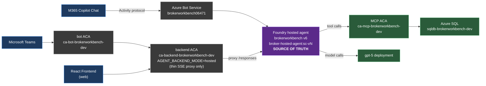

# BrokerWorkbench — Architecture

## One Agent, Three Surfaces

The BrokerWorkbench agent is a **single Foundry-hosted agent** (`brokerworkbench`, currently v6, image `broker-hosted-agent:sc-vN`) that serves three end-user surfaces. There is exactly one place where agent behavior, instructions, and tools live: the hosted-agent container image.



### Why "one agent, three surfaces" matters

- **Single place to change behavior.** Update `backend/agents/config.py` (instructions) or `backend/agents/foundry/handoff.py` (workflow), rebuild the hosted-agent image, publish a new agent version. All three surfaces pick it up. No backend redeploy required for agent-only changes.
- **Single observability story.** All agent runs flow through the same Foundry telemetry + the same `appi-brokerworkbench-dev` App Insights resource.
- **Consistent answers.** Users see the same agent reasoning whether they're in M365 Copilot, Teams, or the web UI.

## Surface paths in detail

### 1. M365 Copilot Chat
1. User types in M365 Copilot.
2. Copilot routes to the Azure Bot Service resource registered when the agent was published from Foundry portal (`brokerworkbench06471`).
3. Bot Service posts an Activity-protocol message to the Foundry hosted-agent endpoint.
4. Hosted agent runs the workflow (Triage → optional handoff → MCP tools → gpt-5) and returns a single response.
5. **RBAC required:** the Bot Service identity needs `Azure AI User` (a.k.a. `Foundry User`, role def `53ca6127-…`) at the **project** scope. The agent's blueprint identity needs the same plus `Cognitive Services OpenAI User`.

### 2. Microsoft Teams
1. Teams DirectLine → bot ACA (`ca-bot-brokerworkbench-dev`).
2. Bot ACA POSTs the user message to backend ACA (`/api/agent/stream`).
3. Backend ACA (`AGENT_BACKEND_MODE=hosted`) proxies the request to the Foundry hosted-agent `/responses` endpoint via `_stream_hosted` in `backend/routers/agents_handoff.py`.
4. SSE stream flows back: backend → bot ACA → Teams (rendered as Adaptive Cards by `bot/card_formatter.py`).

### 3. Web Frontend
1. React app calls backend ACA (`/api/agent/stream`).
2. Same `_stream_hosted` proxy as Teams.
3. SSE renders inline in the chat UI as markdown.

## Legacy / dev-only code paths (DO NOT confuse with prod)

The backend repo contains in-process orchestration code that PRE-DATES the hosted-agent migration:

- `backend/agents/foundry/handoff.py` — builds a `HandoffBuilder` workflow. **In prod, this code is consumed only by the hosted-agent image build** (`backend/agents/foundry/hosted/main.py` imports it). It is also runnable in-process via `AGENT_BACKEND_MODE=fastapi` for local development, but no prod surface uses that mode.
- `_stream_handoff` in `backend/routers/agents_handoff.py` — fires only when `AGENT_BACKEND_MODE != "hosted"`. Prod backend logs a `WARNING` at startup if this is ever the case.

If you're debugging unexpected agent behavior, **always check the hosted-agent image first** (`az acr repository show-tags -n acrbrokerworkbenchdevwnwtqzj2xcdts --repository broker-hosted-agent`) and the deployed agent version in Foundry. The backend's local orchestration code is a red herring for prod traffic.

## Build + deploy cheat sheet (hosted agent)

```bash
# 1. Build new hosted-agent image (run from repo root, or in Azure Cloud Shell if Zscaler port-exhaustion hits)
az acr build \
  -r acrbrokerworkbenchdevwnwtqzj2xcdts \
  -t broker-hosted-agent:sc-v<N> \
  -f backend/agents/foundry/hosted/Dockerfile . --no-logs

# 2. Publish new agent version (pins agent runtime to the new image)
pip install --user "azure-ai-projects==2.1.0" azure-identity
HOSTED_AGENT_IMAGE="acrbrokerworkbenchdevwnwtqzj2xcdts.azurecr.io/broker-hosted-agent:sc-v<N>" \
  python scripts/deploy_hosted_agent.py

# 3. Verify in Foundry — agent should show status=ACTIVE.
#    M365 / Teams / Web pick up the new version automatically
#    (publish config has "Always use latest").
```

## Related references

- Publish to M365 / Teams: <https://learn.microsoft.com/azure/foundry/agents/how-to/publish-copilot>
- Deployment gotchas + RBAC quirks: `/memories/repo/deployment-notes.md`
- Per-surface debugging notes: see HISTORY.md
